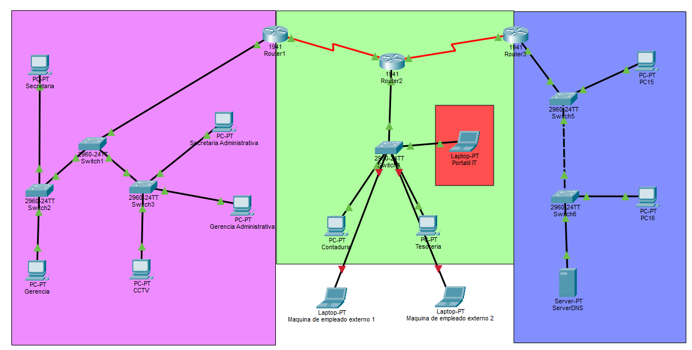
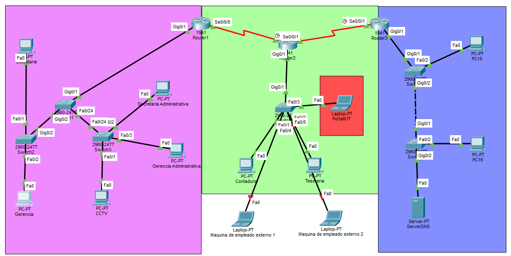

# Challenge2
## Parte visual

## Conexiones

# Configuración de Topología Cisco Packet Tracer

Este documento se irá ampliando a medida que agregues especificaciones. Por ahora cubre la parte 1: **configuración base de los 3 switches** (VLANs, enlaces troncales y puertos de acceso).

## Supuestos usados (dime si algo debe cambiar)

- Switches modelo 2960 (FastEthernet 0/1–0/24), sin `switchport trunk encapsulation dot1q` porque ese modelo solo soporta 802.1Q (no aplica el comando de negociar encapsulación).
- Numeración de VLANs asignada por mí, ya que no se especificó:

| VLAN | Nombre         | Segmento              | Switch |
|------|----------------|------------------------|--------|
| 10   | GERENCIA       | Gerencia               | S2     |
| 20   | SECRETARIA     | Secretaría             | S2     |
| 30   | CCTV           | CCTV                   | S3     |
| 40   | GERENCIA_ADM   | Gerencia Admin         | S3     |
| 50   | SECRETARIA_ADM | Secretaría Admin       | S3     |

- Interfaces asignadas (actualizado según tu topología real):
  - **S1** (switch de distribución): Gi0/1 → R1, Gi0/2 → S2, Fa0/24 → S3 (los tres como enlaces troncales; router-on-a-stick hacia R1).
  - **S2** (acceso): Fa0/1 → PC Secretaría (VLAN 20), Fa0/2 → PC Gerencia (VLAN 10), Gi0/2 → enlace troncal a S1.
  - **S3** (acceso): Fa0/1 → PC CCTV (VLAN 30), Fa0/2 → PC Secretaría Admin (VLAN 50), Fa0/3 → PC Gerencia Admin (VLAN 40), Fa0/24 → enlace troncal a S1.

Si tu topología real usa otros números de puerto, VLANs o nombres, dime y lo ajusto.

---

## 1. Switch S1 (núcleo — conecta S2, S3 y R1)

```
enable
configure terminal
hostname S1
!
vlan 10
 name GERENCIA
vlan 20
 name SECRETARIA
vlan 30
 name CCTV
vlan 40
 name GERENCIA_ADM
vlan 50
 name SECRETARIA_ADM
exit
!
interface GigabitEthernet0/1
 description Enlace_a_R1
 switchport mode trunk
 switchport trunk allowed vlan 10,20,30,40,50
!
interface GigabitEthernet0/2
 description Enlace_a_S2
 switchport mode trunk
 switchport trunk allowed vlan 10,20,30,40,50
!
interface FastEthernet0/24
 description Enlace_a_S3
 switchport mode trunk
 switchport trunk allowed vlan 10,20,30,40,50
!
end
write memory
```

## 2. Switch S2 (Gerencia y Secretaría)

```
enable
configure terminal
hostname S2
!
vlan 10
 name GERENCIA
vlan 20
 name SECRETARIA
exit
!
interface FastEthernet0/1
 description PC_Secretaria
 switchport mode access
 switchport access vlan 20
 switchport port-security
 switchport port-security maximum 1
 switchport port-security mac-address sticky
 switchport port-security violation shutdown
!
interface FastEthernet0/2
 description PC_Gerencia
 switchport mode access
 switchport access vlan 10
 switchport port-security
 switchport port-security maximum 2
 switchport port-security mac-address sticky
 switchport port-security violation restrict
!
interface GigabitEthernet0/2
 description Enlace_a_S1
 switchport mode trunk
 switchport trunk allowed vlan 10,20
!
end
write memory
```

## 3. Switch S3 (CCTV, Secretaría Admin, Gerencia Admin)

```
enable
configure terminal
hostname S3
!
vlan 30
 name CCTV
vlan 40
 name GERENCIA_ADM
vlan 50
 name SECRETARIA_ADM
exit
!
interface FastEthernet0/1
 description PC_CCTV
 switchport mode access
 switchport access vlan 30
 switchport port-security
 switchport port-security maximum 1
 switchport port-security mac-address sticky
 switchport port-security violation shutdown
!
interface FastEthernet0/2
 description PC_Secretaria_Admin
 switchport mode access
 switchport access vlan 50
 switchport port-security
 switchport port-security maximum 1
 switchport port-security mac-address sticky
 switchport port-security violation shutdown
!
interface FastEthernet0/3
 description PC_Gerencia_Admin
 switchport mode access
 switchport access vlan 40
 switchport port-security
 switchport port-security maximum 2
 switchport port-security mac-address sticky
 switchport port-security violation restrict
!
interface FastEthernet0/24
 description Enlace_a_S1
 switchport mode trunk
 switchport trunk allowed vlan 30,40,50
!
end
write memory
```

## Verificación sugerida

```
show vlan brief
show interfaces trunk
show interfaces status
```

## 4. Direccionamiento IP y Configuración de PCs (IP estática)

No diste un esquema de direccionamiento, así que propongo uno simple: una red /24 por VLAN, con el host `.1` reservado para el gateway en R1. Ajústalo si tu ejercicio pide otro rango.

| VLAN | Red              | Gateway (subinterfaz R1) |
|------|------------------|---------------------------|
| 10   | 192.168.10.0/24  | 192.168.10.1               |
| 20   | 192.168.20.0/24  | 192.168.20.1               |
| 30   | 192.168.30.0/24  | 192.168.30.1               |
| 40   | 192.168.40.0/24  | 192.168.40.1               |
| 50   | 192.168.50.0/24  | 192.168.50.1               |

### Configuración por PC

| PC                   | Switch/Puerto | VLAN | IP             | Máscara        | Gateway        |
|----------------------|----------------|------|----------------|-----------------|-----------------|
| PC Gerencia          | S2 Fa0/2       | 10   | 192.168.10.10  | 255.255.255.0   | 192.168.10.1    |
| PC Secretaría        | S2 Fa0/1       | 20   | 192.168.20.10  | 255.255.255.0   | 192.168.20.1    |
| PC CCTV              | S3 Fa0/1       | 30   | 192.168.30.10  | 255.255.255.0   | 192.168.30.1    |
| PC Gerencia Admin    | S3 Fa0/3       | 40   | 192.168.40.10  | 255.255.255.0   | 192.168.40.1    |
| PC Secretaría Admin  | S3 Fa0/2       | 50   | 192.168.50.10  | 255.255.255.0   | 192.168.50.1    |

Las PC no tienen CLI de IOS; en Packet Tracer se configuran así:
1. Clic en la PC → pestaña **Desktop** → **IP Configuration**.
2. Selecciona **Static**.
3. Ingresa la **IP Address**, **Subnet Mask** y **Default Gateway** de la tabla anterior.

> Los gateways de esta tabla quedarán como la IP de las subinterfaces de R1 (una por VLAN, con `encapsulation dot1Q`). Eso lo armamos al configurar R1.

## 5. Topología ampliada (multisede)

Con esto ya quedan las 3 sedes conectadas:

- **Bogotá**: R1 — S1 — (S2, S3), con VLANs (secciones 1-3).
- **Enlace WAN Bogotá–Cali**: R1 Se0/0/0 — Se0/0/0 R2.
- **Cali**: R2 Gi0/1 — Gi0/1 S4 — (PC Contaduría, PC Tesorería, Portátil IT, Empleado Externo 1, Empleado Externo 2), ahora segmentado en VLANs (ver sección 6).
- **Enlace WAN Cali–Cúcuta**: R2 Se0/0/1 — Se0/0/1 R3.
- **Cúcuta**: R3 Gi0/1 — Gi0/1 S5 — PC15; S5 Gi0/2 — Gi0/1 S6 — (PC16, ServerDNS), todos en la misma red.

Cali ya no es red plana: separé Contaduría, Tesorería, Portátil IT y Empleados Externos en 4 VLANs distintas (agrupé los dos Empleado Externo en una sola). Cúcuta sigue plana porque no mencionaste VLANs ahí — dime si también hace falta segmentarla.

## 6. Switch S4 (Cali)

```
enable
configure terminal
hostname S4
!
vlan 60
 name CONTADURIA
vlan 61
 name TESORERIA
vlan 62
 name IT
vlan 63
 name EXTERNOS
exit
!
interface GigabitEthernet0/1
 description Enlace_a_R2
 switchport mode trunk
 switchport trunk allowed vlan 60,61,62,63
!
interface FastEthernet0/1
 description PC_Contaduria
 switchport mode access
 switchport access vlan 60
 switchport port-security
 switchport port-security maximum 1
 switchport port-security mac-address sticky
 switchport port-security violation shutdown
!
interface FastEthernet0/2
 description PC_Tesoreria
 switchport mode access
 switchport access vlan 61
 switchport port-security
 switchport port-security maximum 1
 switchport port-security mac-address sticky
 switchport port-security violation shutdown
!
interface FastEthernet0/3
 description Portatil_IT
 switchport mode access
 switchport access vlan 62
 switchport port-security
 switchport port-security maximum 1
 switchport port-security mac-address sticky
 switchport port-security violation shutdown
!
interface FastEthernet0/4
 description Empleado_Externo_1_BLOQUEADO
 switchport mode access
 switchport access vlan 63
 shutdown
!
interface FastEthernet0/5
 description Empleado_Externo_2_BLOQUEADO
 switchport mode access
 switchport access vlan 63
 shutdown
!
end
write memory
```

## 7. Switch S5 (Cúcuta)

```
enable
configure terminal
hostname S5
!
interface GigabitEthernet0/1
 description Enlace_a_R3
 switchport mode access
!
interface FastEthernet0/2
 description PC15
 switchport mode access
 switchport port-security
 switchport port-security maximum 1
 switchport port-security mac-address sticky
 switchport port-security violation shutdown
!
interface GigabitEthernet0/2
 description Enlace_a_S6
 switchport mode access
!
end
write memory
```

## 8. Switch S6 (Cúcuta)

```
enable
configure terminal
hostname S6
!
interface GigabitEthernet0/1
 description Enlace_a_S5
 switchport mode access
!
interface FastEthernet0/2
 description PC16
 switchport mode access
 switchport port-security
 switchport port-security maximum 1
 switchport port-security mac-address sticky
 switchport port-security violation shutdown
!
interface GigabitEthernet0/2
 description ServerDNS
 switchport mode access
 switchport port-security
 switchport port-security maximum 1
 switchport port-security mac-address sticky
 switchport port-security violation shutdown
!
end
write memory
```

## 9. Direccionamiento IP — Enlaces WAN y redes de Cali/Cúcuta

Esquema propuesto (ajústalo si tu ejercicio exige otro rango):

### Enlaces WAN (punto a punto, /30)

| Enlace   | Red                | Extremo 1                  | Extremo 2                  |
|----------|--------------------|-----------------------------|------------------------------|
| R1 – R2  | 192.168.100.0/30   | R1 Se0/0/0 = 192.168.100.1  | R2 Se0/0/0 = 192.168.100.2   |
| R2 – R3  | 192.168.100.4/30   | R2 Se0/0/1 = 192.168.100.5  | R3 Se0/0/1 = 192.168.100.6   |

### Redes LAN por sede

| Sede / segmento                | Red              | Gateway                          |
|---------------------------------|------------------|-----------------------------------|
| Bogotá VLAN10 Gerencia          | 192.168.10.0/24  | 192.168.10.1 (ya definido)        |
| Bogotá VLAN20 Secretaría        | 192.168.20.0/24  | 192.168.20.1 (ya definido)        |
| Bogotá VLAN30 CCTV              | 192.168.30.0/24  | 192.168.30.1 (ya definido)        |
| Bogotá VLAN40 Gerencia Admin    | 192.168.40.0/24  | 192.168.40.1 (ya definido)        |
| Bogotá VLAN50 Secretaría Admin  | 192.168.50.0/24  | 192.168.50.1 (ya definido)        |
| Cali VLAN60 Contaduría          | 192.168.60.0/24  | 192.168.60.1 (R2 Gi0/1.60)        |
| Cali VLAN61 Tesorería           | 192.168.61.0/24  | 192.168.61.1 (R2 Gi0/1.61)        |
| Cali VLAN62 IT                  | 192.168.62.0/24  | 192.168.62.1 (R2 Gi0/1.62)        |
| Cali VLAN63 Externos            | 192.168.63.0/24  | 192.168.63.1 (R2 Gi0/1.63)        |
| Cúcuta (red plana, S5/S6)       | 192.168.70.0/24  | 192.168.70.1 (R3 Gi0/1)           |

### Configuración de PCs / laptops — Cali

| Dispositivo         | Switch/Puerto | VLAN | IP             | Máscara        | Gateway        |
|----------------------|----------------|------|----------------|-----------------|-----------------|
| PC Contaduría        | S4 Fa0/1       | 60   | 192.168.60.10  | 255.255.255.0   | 192.168.60.1    |
| PC Tesorería         | S4 Fa0/2       | 61   | 192.168.61.10  | 255.255.255.0   | 192.168.61.1    |
| Portátil IT          | S4 Fa0/3       | 62   | 192.168.62.10  | 255.255.255.0   | 192.168.62.1    |
| Empleado Externo 1   | S4 Fa0/4       | 63   | 192.168.63.10  | 255.255.255.0   | 192.168.63.1    |
| Empleado Externo 2   | S4 Fa0/5       | 63   | 192.168.63.11  | 255.255.255.0   | 192.168.63.1    |

> Módulo de red requerido en los 3 portátiles (Portátil IT, Empleado Externo 1 y 2): **PT-LAPTOP-NM-1CFE** (Copper Fast Ethernet) — el laptop no trae puerto Ethernet por defecto en Packet Tracer.

> Portátil IT debe poder conectarse en cualquier puerto de la topología (regla del PDF) — la IP fija de arriba aplica cuando está en Cali; su MAC se autorizará en los demás switches en la sección de Port Security.

### Configuración de PCs / servidor — Cúcuta

| Dispositivo | Switch/Puerto | IP             | Máscara        | Gateway        |
|-------------|----------------|----------------|-----------------|-----------------|
| PC15        | S5 Fa0/2       | 192.168.70.10  | 255.255.255.0   | 192.168.70.1    |
| PC16        | S6 Fa0/2       | 192.168.70.11  | 255.255.255.0   | 192.168.70.1    |
| ServerDNS   | S6 Gi0/2       | 192.168.70.2   | 255.255.255.0   | 192.168.70.1    |

Todos se configuran igual que antes: PC/laptop → **Desktop → IP Configuration → Static**; el servidor DNS se configura desde su propia pestaña **Config → GLOBAL/DNS**, pero la IP/máscara/gateway se ingresan igual en **Config → Interfaz**.

## 10. Configuración de Routers (R1, R2, R3)

### R1 (Bogotá) — subinterfaces router-on-a-stick hacia S1

```
enable
configure terminal
hostname R1
!
interface GigabitEthernet0/1
 no shutdown
!
interface GigabitEthernet0/1.10
 encapsulation dot1Q 10
 ip address 192.168.10.1 255.255.255.0
!
interface GigabitEthernet0/1.20
 encapsulation dot1Q 20
 ip address 192.168.20.1 255.255.255.0
!
interface GigabitEthernet0/1.30
 encapsulation dot1Q 30
 ip address 192.168.30.1 255.255.255.0
!
interface GigabitEthernet0/1.40
 encapsulation dot1Q 40
 ip address 192.168.40.1 255.255.255.0
!
interface GigabitEthernet0/1.50
 encapsulation dot1Q 50
 ip address 192.168.50.1 255.255.255.0
!
interface Serial0/0/0
 ip address 192.168.100.1 255.255.255.252
 no shutdown
!
end
write memory
```

### R2 (Cali) — subinterfaces router-on-a-stick hacia S4 + 2 enlaces seriales

```
enable
configure terminal
hostname R2
!
interface GigabitEthernet0/1
 no shutdown
!
interface GigabitEthernet0/1.60
 encapsulation dot1Q 60
 ip address 192.168.60.1 255.255.255.0
!
interface GigabitEthernet0/1.61
 encapsulation dot1Q 61
 ip address 192.168.61.1 255.255.255.0
!
interface GigabitEthernet0/1.62
 encapsulation dot1Q 62
 ip address 192.168.62.1 255.255.255.0
!
interface GigabitEthernet0/1.63
 encapsulation dot1Q 63
 ip address 192.168.63.1 255.255.255.0
!
interface Serial0/0/0
 ip address 192.168.100.2 255.255.255.252
 clock rate 64000
 no shutdown
!
interface Serial0/0/1
 ip address 192.168.100.5 255.255.255.252
 clock rate 64000
 no shutdown
!
end
write memory
```

### R3 (Cúcuta) — interfaz routada simple + 1 enlace serial

```
enable
configure terminal
hostname R3
!
interface GigabitEthernet0/1
 ip address 192.168.70.1 255.255.255.0
 no shutdown
!
interface Serial0/0/1
 ip address 192.168.100.6 255.255.255.252
 no shutdown
!
end
write memory
```

> **Reloj (clock rate):** confirmado con `show controllers serial 0/0/0` — R2 es DCE en los dos enlaces (hacia R1 y hacia R3), así que el `clock rate 64000` va en sus dos interfaces seriales (ya incluido arriba). R1 y R3 son DTE, no necesitan esa línea.

## 11. Enrutamiento RIPv2

```
! --- R1 ---
enable
configure terminal
router rip
 version 2
 no auto-summary
 network 192.168.10.0
 network 192.168.20.0
 network 192.168.30.0
 network 192.168.40.0
 network 192.168.50.0
 network 192.168.100.0
end
write memory
```

```
! --- R2 ---
enable
configure terminal
router rip
 version 2
 no auto-summary
 network 192.168.60.0
 network 192.168.61.0
 network 192.168.62.0
 network 192.168.63.0
 network 192.168.100.0
end
write memory
```

```
! --- R3 ---
enable
configure terminal
router rip
 version 2
 no auto-summary
 network 192.168.70.0
 network 192.168.100.0
end
write memory
```

### Verificación

```
show ip interface brief
show ip route rip
show ip protocols
ping 192.168.70.10
```

## 12. Resumen de Port Security

| Switch/Puerto | Dispositivo          | Regla                          | Configuración                              |
|-----------------|------------------------|----------------------------------|----------------------------------------------|
| S2 Fa0/1        | PC Secretaría          | Estricta (1 MAC fija)            | max 1, sticky, violation **shutdown**        |
| S2 Fa0/2        | PC Gerencia            | Flexible (permite moverse)       | max 2, sticky, violation **restrict**        |
| S3 Fa0/1        | PC CCTV                | Protección general               | max 1, sticky, violation **shutdown**        |
| S3 Fa0/2        | PC Secretaría Admin    | Estricta                         | max 1, sticky, violation **shutdown**        |
| S3 Fa0/3        | PC Gerencia Admin      | Flexible                         | max 2, sticky, violation **restrict**        |
| S4 Fa0/1        | PC Contaduría          | Protección general               | max 1, sticky, violation **shutdown**        |
| S4 Fa0/2        | PC Tesorería           | Protección general               | max 1, sticky, violation **shutdown**        |
| S4 Fa0/3        | Portátil IT            | Protección general (puerto base) | max 1, sticky, violation **shutdown**        |
| S4 Fa0/4        | Empleado Externo 1     | **Bloqueado por completo**       | `shutdown` (puerto apagado)                  |
| S4 Fa0/5        | Empleado Externo 2     | **Bloqueado por completo**       | `shutdown` (puerto apagado)                  |
| S5 Fa0/2        | PC15                   | Protección general               | max 1, sticky, violation **shutdown**        |
| S6 Fa0/2        | PC16                   | Protección general               | max 1, sticky, violation **shutdown**        |
| S6 Gi0/2        | ServerDNS              | Protegido                        | max 1, sticky, violation **shutdown**        |

**Notas:**
- Restrict vs. shutdown: *restrict* descarta el tráfico no autorizado pero deja el puerto arriba (útil para Gerencia, que se mueve entre switches). *Shutdown* apaga el puerto por completo ante cualquier violación (equipos que no deben moverse).
- Los puertos troncales (Gi0/1 a R1/R2/R3, enlaces entre switches) **no** llevan port-security — solo se aplica en puertos de acceso.
- Con `mac-address sticky`, la primera MAC que se conecte a cada puerto queda guardada automáticamente; no hace falta escribirla a mano salvo que quieras fijarla tú mismo con `switchport port-security mac-address <MAC>`.

### Verificación

```
show port-security
show port-security interface FastEthernet0/1
show port-security address
```

---

## Pendiente para próximas especificaciones
Por ahora no queda nada pendiente de lo que hemos definido. Si surge algo nuevo (ACLs, NAT, DHCP, etc.), lo agrego aquí.
